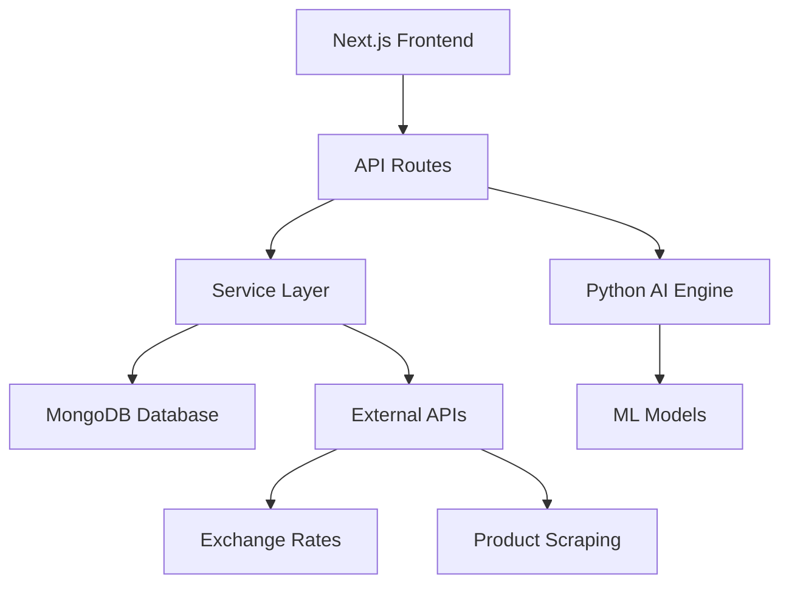

# 🚀 MidoStore - AI-Powered Multi-Seller Dropshipping Platform


> **Transform your e-commerce vision into reality with our cutting-edge multi-seller dropshipping platform that combines the power of AI, modern web technologies, and intelligent business automation.**


## ✨ Features

### 🏪 **Multi-Seller Marketplace**
- **Dynamic Product Variants**: Each product can have multiple seller versions with custom pricing
- **Seller Dashboard**: Comprehensive analytics and product management tools
- **Price Comparison**: Buyers can compare prices across different sellers
- **Verified Sellers**: Trust system with seller verification and ratings

### 🤖 **AI-Powered Intelligence**
- **Machine Learning Recommendations**: LightFM-based recommendation engine
- **Predictive Analytics**: Sales forecasting and trend analysis
- **Smart Pricing**: Dynamic pricing optimization
- **Market Intelligence**: Social trend analysis and competitive insights

### 💳 **Advanced Payment Systems**
- **Cryptocurrency Support**: Bitcoin, Ethereum, and other crypto payments
- **P2P Marketplace**: Peer-to-peer trading capabilities
- **Bybit Integration**: Professional crypto trading integration
- **Traditional Payments**: Stripe and other payment processors

### 🌍 **Global Commerce Features**
- **Multi-Currency Support**: Real-time exchange rate conversion
- **Localization**: Specialized support for Gulf markets (UAE, Saudi Arabia, Kuwait, Qatar, Bahrain, Oman)
- **International Shipping**: Global logistics and tracking
- **Bulk Pricing**: Volume discounts and wholesale pricing

### 📊 **Business Intelligence**
- **Real-Time Analytics**: Live sales tracking and performance metrics
- **Order Batching**: Advanced order management and processing
- **Inventory Management**: Smart stock tracking and alerts
- **Marketing Tools**: Campaign management and advertising features

## 🏗️ Architecture

### **Hybrid Technology Stack**



**Frontend Layer**
- **Next.js 15** with App Router
- **TypeScript** for type safety
- **Tailwind CSS** for responsive design
- **React Context** for state management

**Backend Services**
- **30+ Specialized Services** handling different business domains
- **FastAPI Python Engine** for AI/ML operations
- **Dynamic Service Management** with health monitoring
- **RESTful APIs** with comprehensive endpoints

**Database & Storage**
- **MongoDB** for scalable document storage
- **Optimized Collections** for multi-seller architecture
- **Performance Indexes** for fast queries
- **Analytics-Friendly** data structure

## 🚀 Quick Start

### Prerequisites

- **Node.js** 18+ 
- **npm** 8+
- **Python** 3.8+
- **MongoDB** (local or cloud)
- **Git**

### Installation

1. **Clone the Repository**
   ```bash
   git clone https://github.com/yourusername/midostore.git
   cd midostore
   ```

2. **Install Dependencies**
   ```bash
   npm install
   ```

3. **Setup Environment**
   ```bash
   cp env.example .env.local
   # Edit .env.local with your configuration
   ```

4. **Setup AI Services**
   ```bash
   npm run ai:setup
   ```

5. **Initialize Database**
   ```bash
   npm run db:generate
   npm run db:push
   npm run db:seed
   ```

6. **Start Development Server**
   ```bash
   npm run quick:start
   ```

Visit `http://localhost:3000` to see your application running!

## 📖 Documentation

### **Core Documentation**
- [**API Endpoints**](./docs/README-API-ENDPOINTS.md) - Complete API documentation
- [**Multi-Seller System**](./docs/MULTI_SELLER_SYSTEM_OVERVIEW.md) - Architecture overview
- [**Dynamic Services**](./docs/DYNAMIC_SYSTEM_SUMMARY.md) - Service management guide
- [**WARP Integration**](./WARP.md) - AI assistant guidance

### **Development Guides**
- [**Environment Setup**](./docs/ENV_SETUP_GUIDE.md) - Configuration guide
- [**Scripts Documentation**](./scripts/README.md) - Development scripts
- [**Deployment Guide**](./docs/NETLIFY_DEPLOYMENT_GUIDE.md) - Production deployment

## 🛠️ Development

### **Common Commands**

```bash
# Development
npm run dev                    # Start Next.js development server
npm run quick:start           # Start all services (Next.js + AI)
npm run services:start        # Start dynamic services

# Building
npm run build                 # Production build
npm run build:deploy         # Build and deploy

# Database
npm run db:studio            # Open Prisma Studio
npm run db:seed              # Seed with sample data

# AI Services
npm run ai:start             # Start AI service
npm run ai:train             # Train ML models

# Testing
npm run test:all             # Run all tests
npm run test:apis            # Test API endpoints

# Deployment
npm run netlify:deploy       # Deploy to Netlify
```

### **Service Architecture**

The platform is built with a service-oriented architecture:

**Core Business Services:**
- `seller-service.ts` - Multi-seller management
- `buyer-service.ts` - Product browsing and comparison
- `product-service.ts` - Product catalog management
- `order-batching-service.ts` - Advanced order processing

**AI & Analytics:**
- `ai-orchestrator-service.ts` - Central AI decision making
- `recommendation-service.ts` - ML-powered recommendations
- `analytics-service.ts` - Business intelligence
- `social-trend-analysis-service.ts` - Market analysis

**Payment & Financial:**
- `crypto-payment-service.ts` - Cryptocurrency processing
- `p2p-marketplace-service.ts` - P2P trading
- `exchange-rate-service.ts` - Multi-currency support

## 🚀 Deployment

### **Netlify (Recommended)**

1. **Configure Environment**
   ```bash
   # Copy environment template
   cp netlify.env.example netlify.env
   ```

2. **Deploy**
   ```bash
   npm run netlify:deploy:optimized
   ```

### **Alternative Deployments**
- **Direct Deployment**: `npm run deploy:direct`
- **Docker**: Coming soon
- **Self-hosted**: Manual server deployment

## 🔧 Configuration

### **Environment Variables**

```env
# Database
DATABASE_URL=mongodb://localhost:27017/midostore

# Authentication (optional)
NEXT_PUBLIC_CLERK_PUBLISHABLE_KEY=your_key
CLERK_SECRET_KEY=your_key

# AI Services
AI_SERVICE_URL=http://localhost:8000

# Payment Processing
STRIPE_SECRET_KEY=your_key
BYBIT_API_KEY=your_key
BYBIT_SECRET_KEY=your_key

# External APIs
EXCHANGE_RATE_API_KEY=your_key
```

### **Service Configuration**

The platform uses dynamic service configuration:

```bash
# View current configuration
npm run services:config

# Save configuration
npm run services:status

# Generate environment template
npm run services:env-template
```

## 🧪 Testing

### **Test Coverage**

- ✅ **API Endpoints** - Comprehensive API testing
- ✅ **AI Systems** - ML model performance testing
- ✅ **Services** - Individual service functionality
- ✅ **Authentication** - Security testing
- ✅ **Integration** - End-to-end workflows

### **Running Tests**

```bash
# All tests
npm run test:all

# Specific test suites
npm run test:apis              # API endpoints
npm run test:orchestrator      # AI orchestrator
npm run test:agents           # AI agents
npm run test:auth             # Authentication
npm run test:scraping         # Data scraping
```

## 📊 Performance

### **Benchmarks**
- **Page Load Time**: < 2 seconds
- **API Response**: < 200ms average
- **Database Queries**: Optimized with indexes
- **AI Recommendations**: < 500ms response time

### **Scalability**
- **Multi-Service Architecture**: Horizontal scaling
- **Database Optimization**: Indexed MongoDB collections
- **Caching Strategy**: Redis integration ready
- **CDN Support**: Static asset optimization

## 🤝 Contributing

We welcome contributions! Please see our [Contributing Guide](CONTRIBUTING.md) for details.

### **Development Process**

1. Fork the repository
2. Create a feature branch (`git checkout -b feature/amazing-feature`)
3. Make your changes
4. Add tests for new functionality
5. Commit your changes (`git commit -m 'Add amazing feature'`)
6. Push to the branch (`git push origin feature/amazing-feature`)
7. Open a Pull Request

### **Code Standards**

- **TypeScript**: Strict type checking
- **ESLint**: Code quality enforcement
- **Prettier**: Code formatting
- **Testing**: Required for new features

## 📄 License

This project is licensed under the MIT License - see the [LICENSE](LICENSE) file for details.

## 🙏 Acknowledgments

- **Next.js Team** - Amazing React framework
- **MongoDB** - Scalable database solution
- **LightFM** - Recommendation algorithm
- **Tailwind CSS** - Utility-first CSS framework
- **FastAPI** - High-performance Python web framework

## 📞 Support

- **Documentation**: Check our comprehensive docs above
- **Issues**: [GitHub Issues](https://github.com/yourusername/midostore/issues)
- **Discussions**: [GitHub Discussions](https://github.com/yourusername/midostore/discussions)
- **Email**: support@midostore.com

## 🗺️ Roadmap

### **Phase 1 (Current)** ✅
- Multi-seller marketplace
- AI-powered recommendations
- Payment processing
- Gulf market localization

### **Phase 2 (Q1 2024)** 🔄
- Mobile applications
- Advanced analytics dashboard
- API marketplace
- Third-party integrations

### **Phase 3 (Q2 2024)** 📋
- Blockchain integration
- Advanced ML features
- International expansion
- Enterprise solutions

---

<div align="center">

**🚀 Ready to revolutionize e-commerce?**

[Get Started](#quick-start) • [View Demo](https://midostore.netlify.app) • [Read Docs](./docs/README-API-ENDPOINTS.md)

*Built with ❤️ for the future of commerce*

</div>
